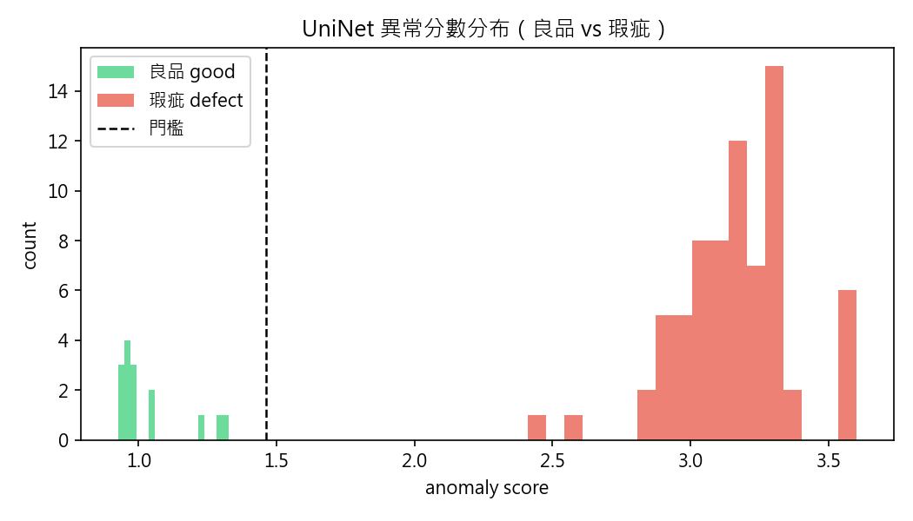
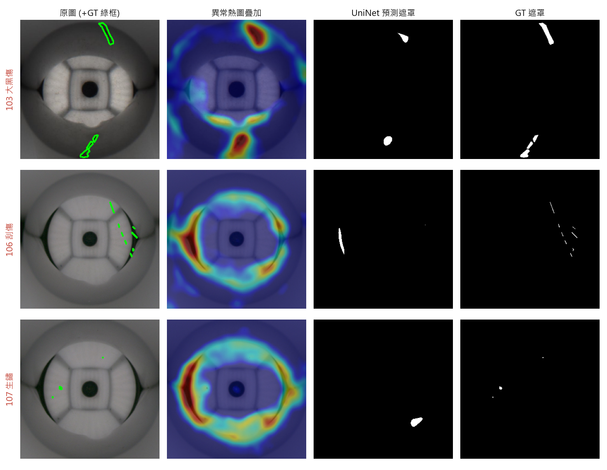
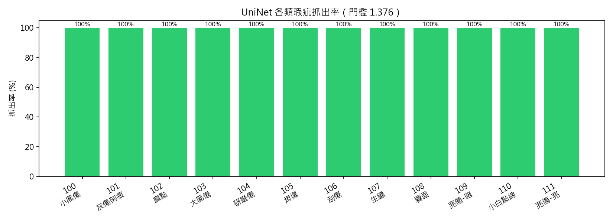
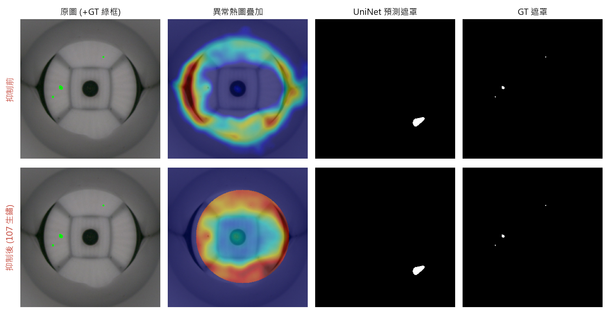
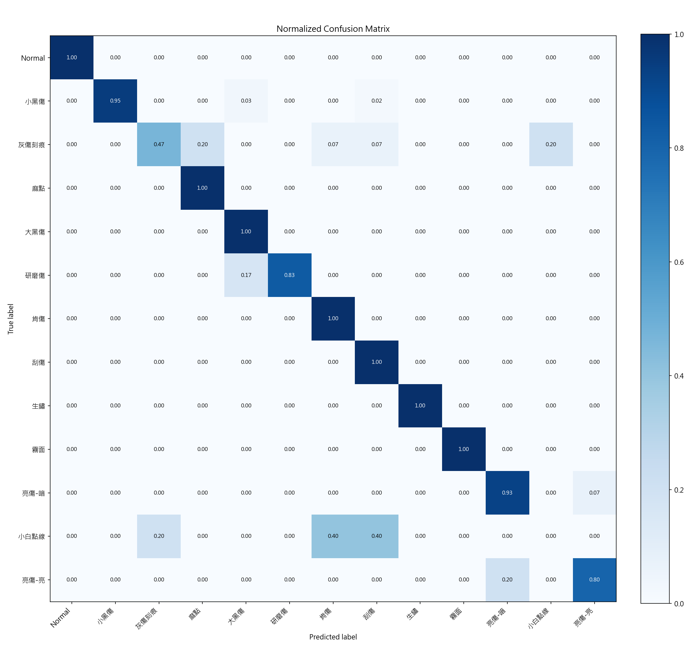
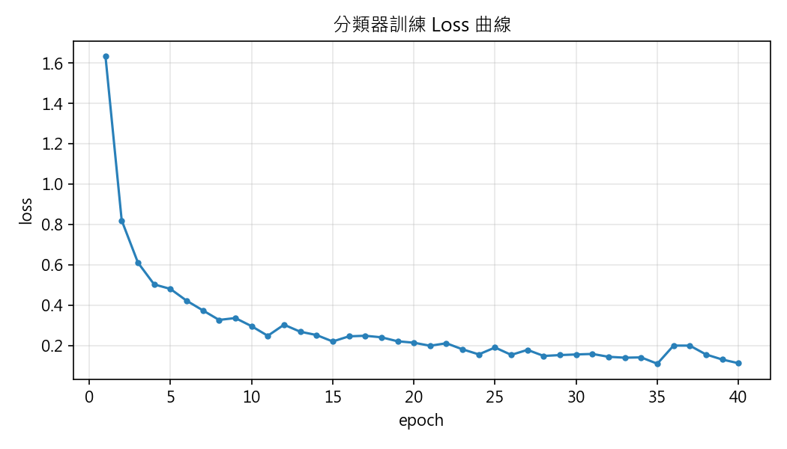
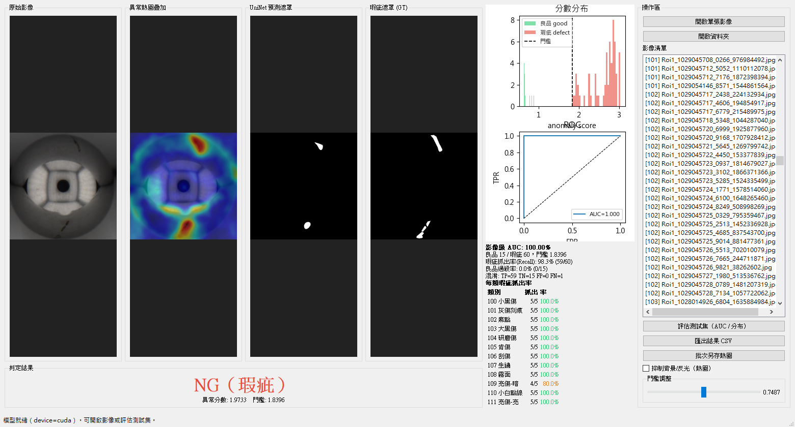

# 鋼珠表面瑕疵檢測 — 成果報告

> 機器視覺應用（MVA）專題　|　更新：2026-06-20
> 程式碼：<https://github.com/kaihan0515/UniNet>（基於 CVPR 2025 官方 UniNet）

---

## 1. 專案概述

針對**鋼珠（steel ball）表面瑕疵**自動檢測,建立兩條互補的深度學習模型:

| 模型 | 任務 | 方法 |
|------|------|------|
| **UniNet** | 判斷「**是否有瑕疵**」(OK/NG) | 異常偵測(只用良品訓練) |
| **ResNet18** | 判斷「**是哪一種瑕疵**」(13 類) | 監督式多類別分類 |

> 流程定位:UniNet 先在產線**抓出不良品**,分類器再對不良品**判定瑕疵類型**。

資料:良品 104 張、12 種瑕疵共 961 張(各附 LabelMe 標註)。瑕疵極小(面積中位數約佔影像 0.1%)。

---

## 2. 成果一:異常偵測（UniNet）

只用良品影像訓練,模型對偏離正常樣態者給出高「異常分數」。

### 2.1 檢測效能

| 指標 | 數值 | 意義 |
|------|------|------|
| **Image AUROC** | **100** | 影像級 OK/NG 完美區分 |
| **Pixel AUROC** | **83.2** | 像素級瑕疵定位 |
| **Pixel AUPRO** | **58.6** | 區域重疊品質 |

良品與瑕疵的異常分數**完全分離**(良品 ≤ 1.33,瑕疵 ≥ 2.41),對應 image AUROC = 100:



### 2.2 瑕疵定位（熱圖 + 預測遮罩 vs GT）

下圖每列為一種瑕疵,由左至右:**原圖(綠框=GT) | 異常熱圖 | UniNet 預測遮罩 | GT 遮罩**。
其中 **GT 遮罩來自 LabelMe JSON 人工標註**(非模型輸出);**UniNet 預測遮罩**則是模型異常圖取「球內最異常的 ~1% 區域」二值化,可與 GT 直接比對。

對**明顯瑕疵**(如大黑傷)預測位置與 GT 吻合;對**極小瑕疵**(如生鏽小點)較難精準定位(對應 pixel AUROC ~83、且受反光環干擾)。



### 2.3 各類瑕疵抓出率

在門檻 1.376（良品最高分 ×1.1）下,**12 種瑕疵全部 100% 抓出(961/961),良品零過殺(0/15)**:

| 類別 | 數量 | 抓出 | 抓出率 | | 類別 | 數量 | 抓出 | 抓出率 |
|------|----:|----:|------:|---|------|----:|----:|------:|
| 100 小黑傷 | 312 | 312 | 100% | | 106 刮傷 | 79 | 79 | 100% |
| 101 灰傷刻痕 | 77 | 77 | 100% | | 107 生鏽 | 30 | 30 | 100% |
| 102 麻點 | 24 | 24 | 100% | | 108 霧面 | 24 | 24 | 100% |
| 103 大黑傷 | 175 | 175 | 100% | | 109 亮傷-暗 | 71 | 71 | 100% |
| 104 研磨傷 | 62 | 62 | 100% | | 110 小白點線 | 24 | 24 | 100% |
| 105 肯傷 | 56 | 56 | 100% | | 111 亮傷-亮 | 27 | 27 | 100% |
| **良品 (過殺)** | **15** | **0 NG** | **0%** | | **總計** | **961** | **961** | **100%** |



---

## 3. 成果二:背景/反光抑制

**問題**:鋼珠的圓頂反光環與角落背景會被誤判為異常(也是 pixel AUROC 受限的主因)。

**後處理**:減去「良品平均異常圖」+ 遮掉偵測到的鋼珠圓形外區域。**異常分數不變**(僅清理熱圖)。

下圖上排為抑制前、下排為抑制後 —— 抑制後熱圖**收斂在鋼珠範圍內**,角落背景被乾淨去除:



> 反光環為部分削弱;根本解法為**蒐集更多良品重訓**(模型看過足夠多良品後會將反光環視為正常)。

---

## 4. 成果三:瑕疵分類（多類別）

以 ResNet18 遷移學習,將影像分到 **13 類**(Normal + 12 種瑕疵),分層 80/20 切分(訓練 852 / 測試 213)。

### 4.1 分類效能

- **測試準確率 = 90.6%**
- 多數類別 0.95–1.00;弱類為**灰傷刻痕、小白點線**(測試樣本僅 5–15 張)。

### 4.2 正規化混淆矩陣



### 4.3 訓練 Loss 曲線



---

## 5. 系統介面（PyQt5）

開發了 MVC 架構的成效檢視介面 `uninet_gui.py`,整合上述模型:

- 三聯顯示:**原圖 / 異常熱圖疊加 / GT 遮罩**,OK/NG 即時判定
- 門檻滑桿、測試集評估(AUC/ROC、**每類瑕疵抓出率**、過殺率/抓出率)
- 匯出結果 CSV、批次另存熱圖、**背景/反光抑制**勾選
- 所有操作控制集中於右側操作區



> 介面截圖:左為三聯影像與 **NG（瑕疵）** 判定,中為分數分布/ROC 與每類抓出率,右為操作區。

```bash
conda activate MVA_py310_cu121
cd D:\111370211\MVA\final\UniNet
python uninet_gui.py
```

---

## 6. 結論與未來工作

**結論**:UniNet 在鋼珠檢測達成**影像級 100% AUROC**(可上線等級),搭配多類別分類器(90.6%)可同時完成「抓不良品 + 判瑕疵類型」。

**未來工作**:

| 優先 | 項目 |
|------|------|
| ⭐ | 蒐集更多良品重訓 → 提升像素定位、根除反光環誤判 |
| ⭐ | 弱類(灰傷刻痕/小白點線)補資料或換 ResNet50 |
| ○ | 調 UniNet 超參數;定部署門檻並輸出產線報表 |

---

> 圖檔由 `make_report_figs.py` 產生(`report/figs/`)。完整技術細節見 [`PROGRESS_REPORT.md`](PROGRESS_REPORT.md)。
